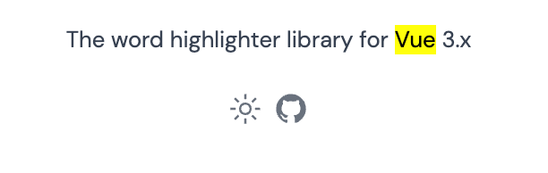

<div align="center" >

</div>

<h1 align="center">Paragraph Highlight</h1>

<p align="center">
<a href="https://www.npmjs.com/package/@elonehoo/paragraph-highlight"></a>
</p>

## Install

```bash
# npm 
npm i @elonehoo/paragraph-highlight

# yarn
yarn add @elonehoo/paragraph-highlight

# pnpm
pnpm i @elonehoo/paragraph-highlight
```

## Usage

To use it, just provide it with search words to props and a body of text to default slots.

```vue
<script setup lang="ts">
import paragraphHighlight from '@elonehoo/paragraph-highlight/src'
</script>

<template>
  <paragraphHighlight query="vue">The word highlighter library for Vue 3.x</paragraphHighlight>
</template>
```

Output



## Details
### Props

| Property | Type | Required? | Description |
|:---|:---|:---:|:---|
| query | String or RegExp | ✓ | Search words. Can be use string or regular expressions. |
| caseSensitive | Boolean |  | Search should be case sensitive. defaults to `false`. |
| splitBySpace | Boolean |  | Whether split the string with spaces to make it a search string. If false, the string is being searched as a whole word. defaults to `false`. When the query is set to a RegExp, the value of splitBySpace will be set to false.  |
| highlightTag | String |  | Type of tag to wrap around highlighted matches; defaults to `mark`. |
| highlightClass | String or Object or Array |  | Classes to be added to highlighted tag. Similar to class bindings in vue, it accepts Array syntax, Object syntax, or class as String.|
| highlightStyle | String or Object or Array | | Styles to be applied to highlighted tag. Similar to style bindings in vue, it accepts Array syntax, Object syntax, or plain styling as String. |
| wrapperTag | String |  | Type of tag to wrap around whole text; defaults to `span`. |
| wrapperClass | String or Object or Array |  | Classes to be added to wrap around the whole tag. Similar to class bindings in vue, it accepts Array syntax, Object syntax, or class as String. |
| textToHighlight | String |  | Text to highlight matches in. If this is not specified, the default slot value will be used for the search.  |

### Emits

| Property | Type |  Description |
|:---|:---:|:---|
| matches | Array | Returns matches words. This event fires when mounted and when the query and highlighted text are changed.|

By using matches emit, you can know from the parent component whether it is highlighted by VueWordHighlighter or not.

<details>
<summary>Example</summary>

```vue
<template>
  <div>
    Matched word count: {{ matches.length }}
  </div>
  <paragraphHighlight query="vue" @matches="(e) => { matches = e }">
    The word highlighter library for Vue 3.x
  </paragraphHighlight>
</template>
<script setup lang="ts">
import { ref } from "vue";
import paragraphHighlight from '@elonehoo/paragraph-highlight/src'
const matches = ref([]);
</script>
```

</details>
